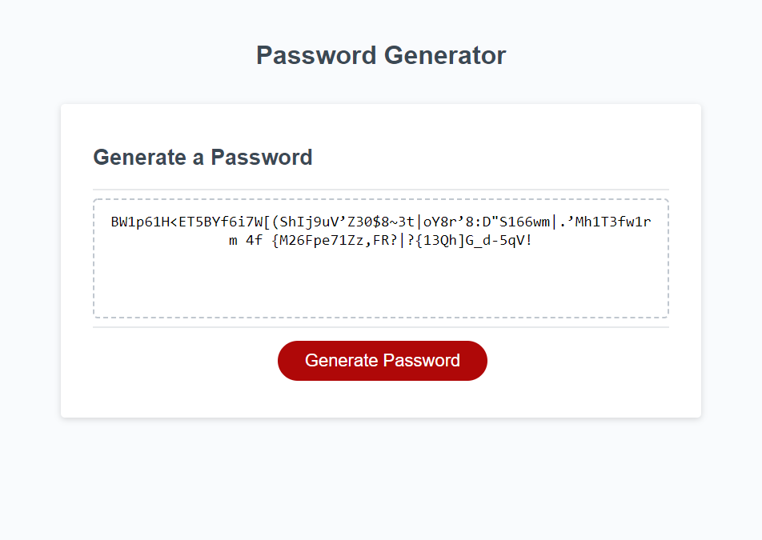

# Password Generator

## Contributor - Chris Kimball

### Description
---------------
The following project is the web application that enables the user to generate a random password based off the criteria that they specify. The user can choose their desired password length between 8 and 128 characters. Whether they want to include numbers, lowercase letters, uppercase letters, and/or special characters.

When a user clicks the "Generate Password" button they will be prompted to input the following data
* How many characters should the password be?
* Should numbers be included?
* Should lowercase letters be included?
* Should uppercase letters be included?
* Should special characters be included?

If the user chooses a password length value outside of the minimum/maximum length parameters they will be alerted they need to pick a length between 8 and 128 and have to re-run the application.

If the user chooses not to include all four character types (numbers/lower/upper/special characters) then they will be alerted that they need to pick at least one character type and have to re-run the application.

Each character type that the user opts to include in their password will be randomly selected and then once the random character type is selected a random character from within the character type will be added to the password. The application will repeat this process until the password length has been reached, which will then be returned to the user.

This extra level of randomization will add additional security to the password as each character type will have an equal probability of being added regardless of the number of characters in a given character type (i.e. there are only 10 numbers versus 26 characters in the alphabet).

The user can run this password generator as many times as they want without having to refresh the page and they will continue to be served different passwords.

### Web addresses
---------------
*  [Deployed Website](https://chriskimball.github.io/pw-gen9999/ "Horiseon Social Solution Services")

*  [Github Repository](https://github.com/chriskimball/pw-gen9999 "Github Repo")

### Installation
---------------
1. Clone this Git repository
2. Navigate to repository in local directory.
3. Open index.html on default web browser.

### Screenshot
---------------

### External Resources
* [List of special characters included in application](https://www.owasp.org/index.php/Password_special_characters "Password Special Characters")

### Copyright Info
---------------
© 2021 Trilogy Education Services, LLC, a 2U, Inc. brand. Confidential and Proprietary. All Rights Reserved.